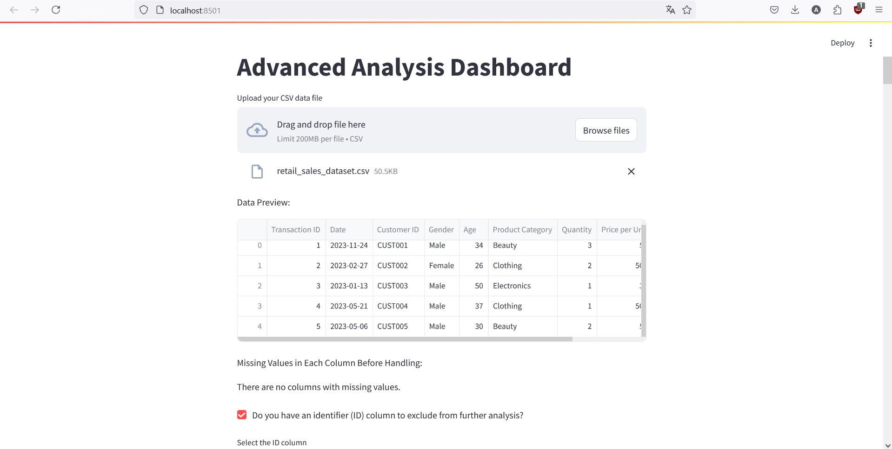
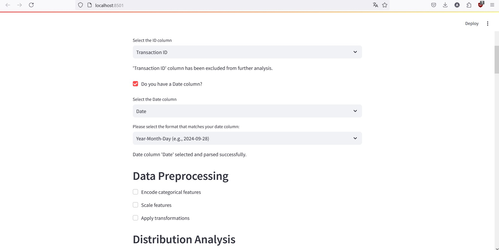
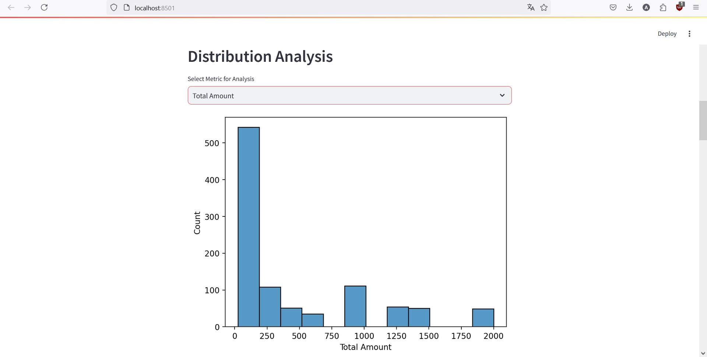
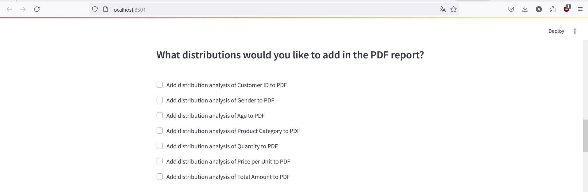
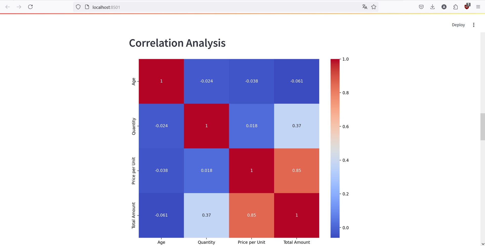
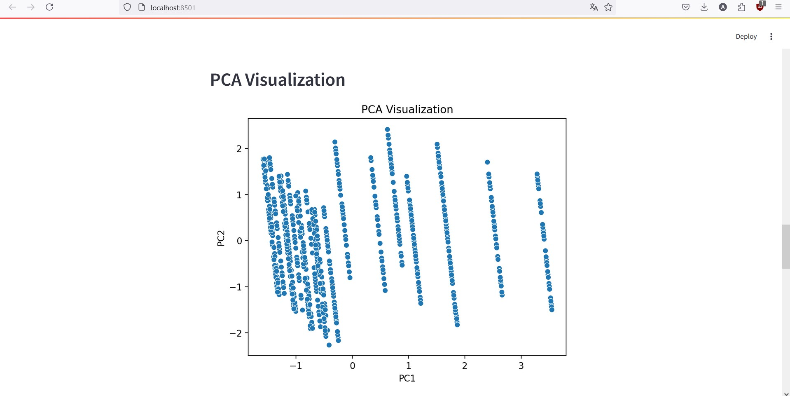
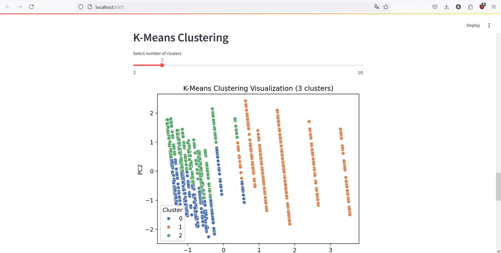
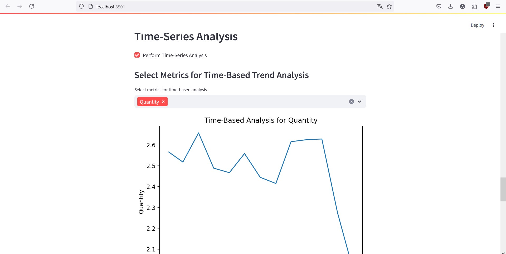
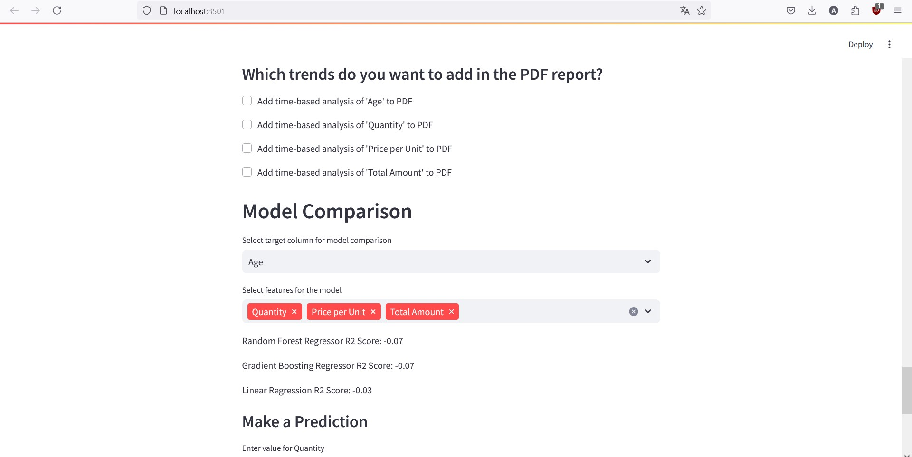
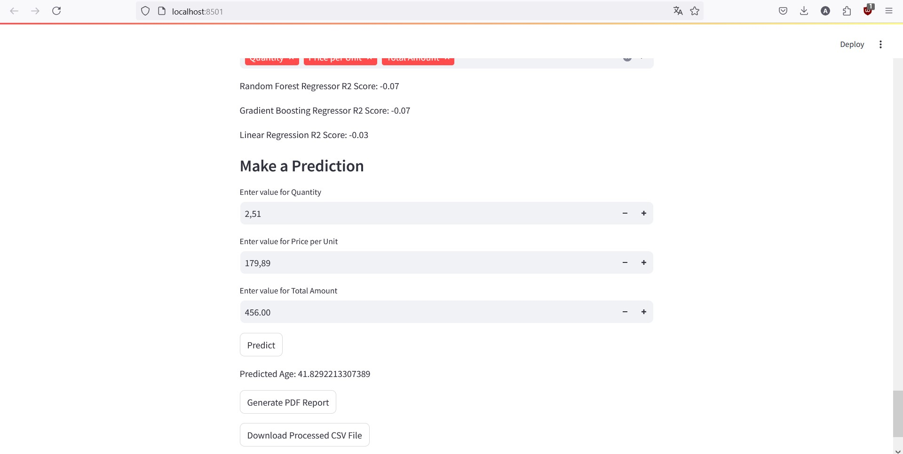

# Automated Data Analysis Dashboard

This project is an interactive data analysis dashboard, built with Streamlit, that allows users to upload CSV datasets and perform a variety of data analyses, including distribution, correlation, PCA, clustering, time-series analysis, and model comparison. Users can preprocess the data, visualize insights, and export results in a detailed PDF report.

## Table of Contents
- [Features](#features)
- [Dependencies](#dependencies)
- [Usage](#usage)
- [Project Structure](#project-structure)

## Features

- **Data Upload and Preview**: Easily upload CSV files and preview the dataset.
- **Data Preprocessing**: Handle missing values, encode categorical data, and scale numerical features.
- **Distribution Analysis**: Visualize the distribution of different metrics in the dataset.
- **Correlation Analysis**: Generate heatmaps to identify correlations between numeric columns.
- **PCA Visualization**: Perform Principal Component Analysis and visualize the reduced dimensions.
- **K-Means Clustering**: Apply K-Means clustering and visualize the clusters in PCA space.
- **Time-Series Analysis**: Analyze trends over time for selected metrics.
- **Model Comparison**: Compare different machine learning models for regression or classification tasks.
- **PDF Report Generation**: Export analysis results and visualizations in a well-structured PDF report.
- **Download Processed Data**: Download the preprocessed dataset in CSV format.

## Dependencies

Install the necessary dependencies from the requirements.txt file using:
```bash
pip install -r requirements.txt
```
## Usage

```bash
streamlit run main.py
```
Once the server starts, you can upload a CSV dataset and interact with various analytical tools provided by the dashboard.

### Example Workflow

1. **Upload CSV**: Use the file uploader to add your dataset.
2. **Preview Data**: See the first few rows and check for missing values.
3. **Preprocess Data**: Choose how to handle missing values and encode categorical features.
4. **Perform Analysis**: Run distribution, correlation, PCA, clustering, and time-series analyses.
5. **Compare Models**: Select a target and features to compare regression or classification models.
6. **Optional Time-Series Analysis**: Analyze trends over time for selected metrics if the dataset contains a date column.
7. **Generate Report**: Export all results in a single PDF file.
8. **Download Processed Data**: Save the processed version of your dataset.

## Project Structure

- **`main.py`**: Entry point for the Streamlit application.
- **`preprocessing.py`**: Contains functions for preprocessing the dataset, including handling missing values and scaling.
- **`analysis.py`**: Functions for distribution, correlation, PCA, and clustering analyses.
- **`clustering_analysis.py`**: Clustering functions with additional visualization options.
- **`time_series_analysis.py`**: Time-series analysis of numeric features.
- **`model_comparison.py`**: Functions for comparing classification and regression models.
- **`utils.py`**: Utility functions, such as loading data and exporting figures to PDF.


## Example 











